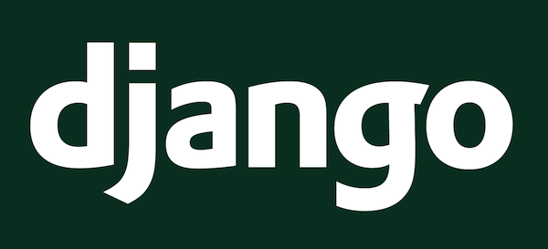

# July 2021 | Django Tutorial


<br/><br/>
Yadira Taylor will be presenting a tutorial where we build a mini stock market application using Django.

This will be a live workshop, where participants will get exposure to the Django web framework, and will build code through the workshop.

*Specifically, we will do the following:*
- [ ] Create Django project
- [ ] Create Django app
- [ ] Run a Django Server
- [ ] Schema planning, models & migration
- [ ] Admin customization
- [ ] Form Handling
- [ ] Basic charting

LEVEL<br/>
Intermediate.<br/>
Python experience will be useful. No Django experience required.


## SYSTEM SETUP

### 1. Git and GitHub account

   If you want to use the sample repository, you will need a GitHub account, and SSH key.

   See: [Git installation](https://git-scm.com/book/en/v2/Getting-Started-Installing-Git)

### 2. Python >= 3.6

   Please have Python >= 3.6 installed if you haven't done already.

   See: [Python Downloads page](https://www.python.org/downloads/)


### 3. Clone the repositoty
You can clone the sample repository.  And then install necessary packages.
```
git clone https://github.com/sanrioyt/stock_market_django.git
```
It will create a new folder named `stock_market_django` with all the content
you will need.  Go into the folder.
```
cd stock_market_django
```

### 4a) Create a virtual environment

```
python -m venv django-demo
source django-demo/bin/activate
```

### 4b) Install the dependencies into the virtual environment.

   In source code: [requirements.txt](https://github.com/sanrioyt/stock_market_django/blob/master/requirements.txt)

```
python -m pip install --upgrade pip
pip install -r requirements.txt
```
## RESOURCES

[Houston PyLadies July 2021 meetup](https://www.meetup.com/Houston_PyLadies/events/gsrjxrycckbrb/)


[Django source code in Github](https://github.com/sanrioyt/stock_market_django)